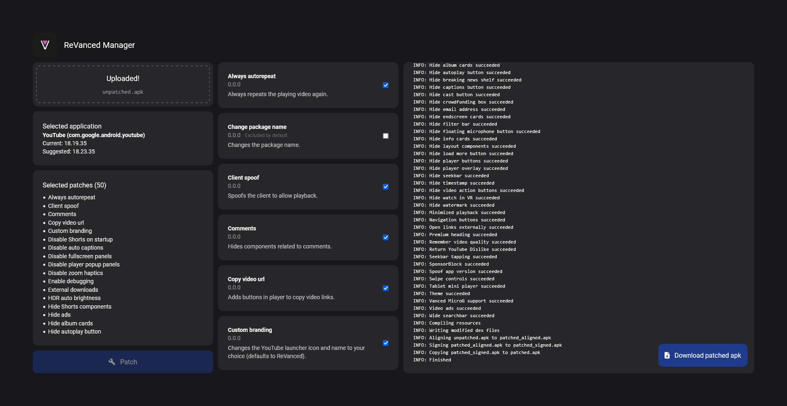
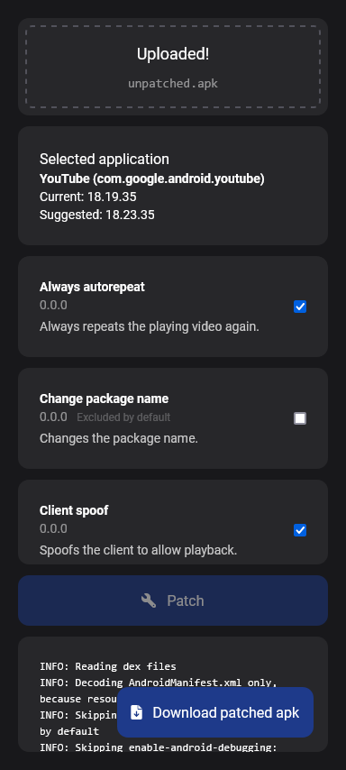

# ReVanced Web App

#### Video Demo:  [ReVanced Web App]([https://youtu.be/dQw4w9WgXcQ](https://youtu.be/-MK7L0JYTxU))

#### Description:

A web implementation of the popular [ReVanced](https://github.com/ReVanced)!
Patch your android apps on a familiar interface but now on powerful PC hardware.
Covers those who find the mobile app [ReVanced Manager](https://github.com/revanced/revanced-manager) occasionally slow and buggy 
or the command line [ReVanced CLI](https://github.com/revanced/revanced-cli) a bit cryptic to set up and use.

#### Specifications

- Built on Flask and Javascript.
- Applies styles from [Tailwind CSS](https://tailwindcss.com/).
- Runs [ReVanced-CLI](https://github.com/revanced/revanced-cli) with Java SDK 11.
- Gets latest patches from the [official repo](https://raw.githubusercontent.com/ReVanced/revanced-patches/main/patches.json).
- Uses [AAPT](https://developer.android.com/tools/aapt2) to read and verify APK manifest data.

#### Preview

Full layout             |  Mobile layout
:-------------------------:|:-------------------------:
  |  

<!-- #### Prerequisites
Download [Java SDK 11.0.2](https://jdk.java.net/archive/). 
Finally, extract it into `/revanced` directory, then rename the extracted folder as `jdk`.
The complete path for Java should now be `/revanced/jdk/bin/java.exe`. -->

#### Disclaimer
This is not an official app. This app simply utilizes ReVanced in the backend.

#### Motivation

The mobile app is occasionally buggy and slow on some devices,
e.g. the patch process eventually freezes especially upon leaving and returning to the app. 
The CLI option is versatile but non-techy people may find it hard to set up and use.
This project combines the accessibility of the mobile app and the efficiency of CLI.

<h5>Dedication to CS50</h5>

  I needed to build something for the <a href="https://www.edx.org/course/introduction-computer-science-harvardx-cs50x">CS50</a> final project.
  I completed this project in 3 days, thanks to ChatGPT for helping me troubleshoot errors.
  This is relatively easier than solving the Tideman problem set!
    
  I learned a lot about the communication logic between `app.routes` in Flask and `event.sources` in Javascript. 
  I should study proper coding paradigms for writing cleaner code for my next project.

