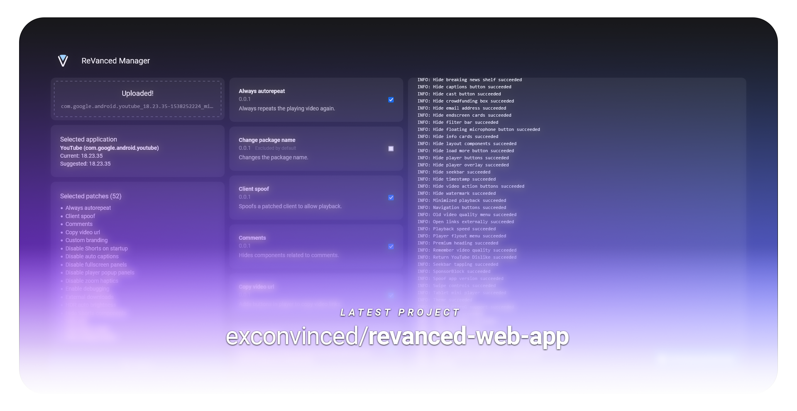
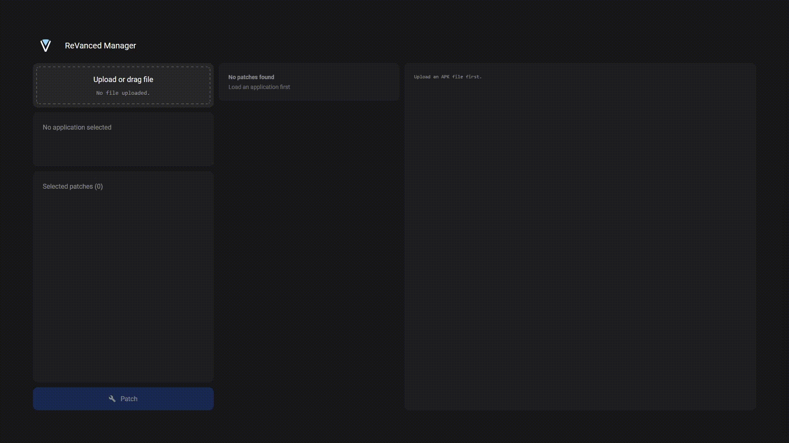
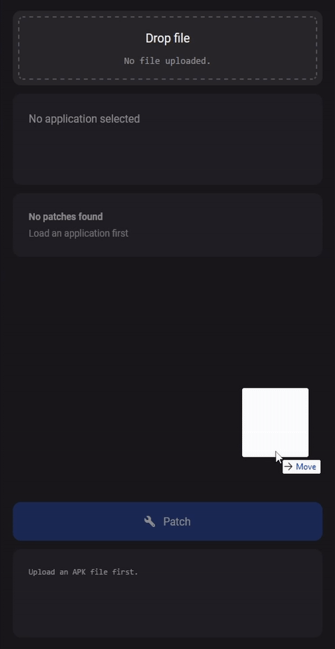

    A web implementation of the popular
    <a href="https://github.com/ReVanced">
        <b>ReVanced</b>
    </a>!
      Patch your apps on a familiar interface, now on powerful PC hardware.
      Built with Flask and Javascript.

 &nbsp;

    <h3>
        ✨ Download latest build:
        <a href="https://github.com/exconvinced/revanced-web-app/releases/latest">
            v1.0.0
        </a>
    </h3>

    <em>
        Prerequisites:
        <a href="https://www.python.org/downloads/release/python-3106/">
            Python 3
        </a>,
        <a href="https://jdk.java.net/archive/">OpenJDK 11</a>
         
        Usage:
        Run <code>launcher.bat</code> or <code>launcher.sh</code>
    </em>

 &nbsp;

    <h3>
        ReVanced components in use
    </h3>

    <samp>cli</samp> 
    <a href="https://github.com/ReVanced/revanced-cli/releases/tag/v3.1.0">
        <b>v3.1.0</b>
    </a>
    &nbsp;
    <samp>patches</samp> 
    <a href="https://github.com/ReVanced/revanced-patches/releases/tag/v2.189.0">
        <b>v2.189.0</b>
    </a>
    &nbsp;
    <samp>integrations</samp> 
    <a href="https://github.com/ReVanced/revanced-integrations/releases/tag/v0.117.0">
        <b>v0.117.0</b>
    </a>

 &nbsp;

    
    

        <em>
            Watch video demo
            <a href="https://youtu.be/-MK7L0JYTxU">here</a>
        </em>

 &nbsp;
 &nbsp;

    

        Motivation
    

     
    

        This project combines the familiar user experience of the mobile app  
        and the stability of the CLI, giving you the best of both worlds,  
        and potentially saving you time from troubleshooting errors.
    

    

        Dedication
    

     
    

        ReVanced Web App was initially my final project for <a href="https://www.edx.org/course/introduction-computer-science-harvardx-cs50x">CS50x</a>.  
        Driven by the stellar learning experience provided by the course,  
        I was able to complete first working web app sooner than expected.   
        Never once in my life have I genuinely enjoyed an online course.  
        In fact, I would definitely recommend the CS50 series to anyone  
        for the sake of attending Professor Malan's lectures!
    

    

        Appreciation 
    

     
    

        I couldn't have been any happier! This project has reached the radar of  
        the ReVanced team and stargazers, receiving their blessings. You lots  
        prevented this project from going stale. More commits to come!
    

